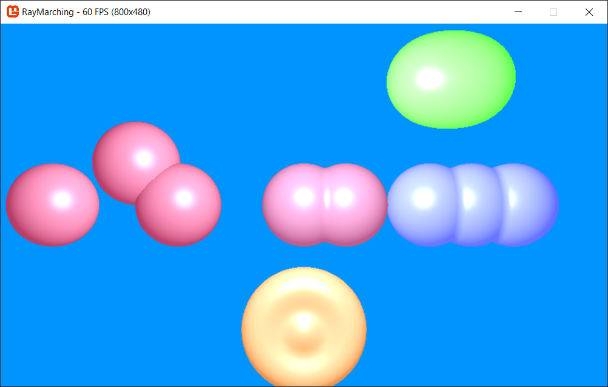

# Ray marching demo with Signed distance fields

Realtime compute shader based raymarching with [CSG](https://en.wikipedia.org/wiki/Constructive_solid_geometry) based on [SDF](https://en.wikipedia.org/wiki/Signed_distance_function):



Gif:


___

# Setup

Built with Visual Studio 2019 and .Net Core 3.1.

The compute shader implementation is in its [own repository](https://github.com/MarcStan/monogame-framework-computeshader) and referenced via a git submodule. Therefore you must run:

```
git submodule init && git submodule update
```

after checkout to build the solution successfully.

# Details

* Uses signed distance fields to define simple geometry
* Uses CSG based operations to create complex geometry from many simple pieces
* configuration options (currently limited to file/command line based at startup)
* player & object movement within the scene

# Known issues

* purple screen when using compute shader on mobile chipsets (Intel Graphics 6xx and the likes). The shader simply doesn't run/output anything resulting in the default texture color (purple) being shown
* AccessViolationException on linkProgram on mobile chipsets (Intel Graphis 6xx and the likes)

# Sources

* [Alan Zucconi - Signed distance functions](https://www.alanzucconi.com/2016/07/01/signed-distance-functions/)
* [iq's distance functions](https://www.iquilezles.org/www/articles/distfunctions/distfunctions.htm)
* [Jamie Wong - Ray marching](http://jamie-wong.com/2016/07/15/ray-marching-signed-distance-functions/)
* [jasmcole.com - Signed distance fields](https://jasmcole.com/2019/10/03/signed-distance-fields/)